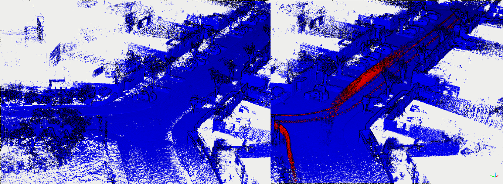

OctoMap
---

Reference [octomapping](https://github.com/OctoMap/octomap_mapping) when I write this codes.

No ros version! This method include improved please check [our benchmark paper](https://arxiv.org/abs/2307.07260) for more detail.

pcd files are enough to run this program. Need transformed and pose in VIEWPOINT. 

Please reference our [DynamicMap benchmark](https://github.com/KTH-RPL/DynamicMap_Benchmark) for more detail on datasets.

## Build & RUN

Build
```bash
cd ${this_repo}
mkdir build && cd build
cmake .. && make
./octomap_run /home/kin/data/00 ../assets/config_fg.yaml -1
```
- `-1` means all frames in the pcd folder, default is only 1 frame.

Result, left is octomap_fg output, right is ground truth on KITTI sequence 00:


Dependencies:
1. PCL

2. glog gflag (only for print)
   
    ```bash
    sh -c "$(wget -O- https://raw.githubusercontent.com/Kin-Zhang/Kin-Zhang/main/Dockerfiles/latest_glog_gflag.sh)"
    ```

3. yaml-cpp
    Please set the FLAG, check this issue if you want to know more: https://github.com/jbeder/yaml-cpp/issues/682, [TOOD inside the CMakeLists.txt](https://github.com/jbeder/yaml-cpp/issues/566)

    If you install in Ubuntu 22.04, please check this commit: https://github.com/jbeder/yaml-cpp/commit/c86a9e424c5ee48e04e0412e9edf44f758e38fb9 which is the version could build in 22.04

    ```sh
    cd ${Tmp_folder}
    git clone https://github.com/jbeder/yaml-cpp.git && cd yaml-cpp
    env CFLAGS='-fPIC' CXXFLAGS='-fPIC' cmake -Bbuild
    cmake --build build --config Release
    sudo cmake --build build --config Release --target install
    ```
    
### Cite our benchmark
```
@article{zhang2023benchmark,
  author={Qingwen Zhang, Daniel Duberg, Ruoyu Geng, Mingkai Jia, Lujia Wang and Patric Jensfelt},
  title={A Dynamic Points Removal Benchmark in Point Cloud Maps},
  journal={arXiv preprint arXiv:2307.07260},
  year={2023}
}
```